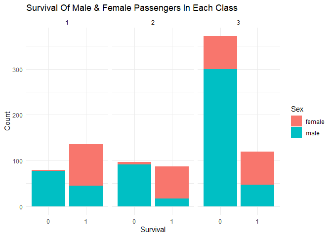
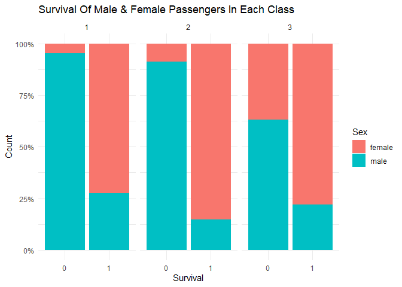

# Machine Learning With R: Building A Logistic Regression Model To Predict The Survivors Of the Titanic Disaster
### Jarred Petersen

During this project, I will train logistic regression model to predict
whether a passenger will survive the sinking of the Titanic based on the
sex, gender, class, ticket fare, and family size of the passenger in
question. This project will display multiple data analytic skills such
as data cleaning, data visualization, use of machine learning models,
and understanding and interpreting its output. Please find the link to
the csv file used below:

*Link to csv*

I will be using the csv file found on the following link
<https://www.kaggle.com/code/alexisbcook/titanic-tutorial/notebook>

### Load Packages

    library(readr)       # load readr package
    library(tidyverse)   # load tidyverse package

    ## ── Attaching core tidyverse packages ──────────────────────── tidyverse 2.0.0 ──
    ## ✔ dplyr     1.1.4     ✔ purrr     1.0.2
    ## ✔ forcats   1.0.0     ✔ stringr   1.5.1
    ## ✔ ggplot2   3.4.4     ✔ tibble    3.2.1
    ## ✔ lubridate 1.9.3     ✔ tidyr     1.3.0
    ## ── Conflicts ────────────────────────────────────────── tidyverse_conflicts() ──
    ## ✖ dplyr::filter() masks stats::filter()
    ## ✖ dplyr::lag()    masks stats::lag()
    ## ℹ Use the conflicted package (<http://conflicted.r-lib.org/>) to force all conflicts to become errors

    library(ggplot2)     # load ggplot2 package
    library(dplyr)       # load dplyr package
    library(mlr)         # load the mlr package

    ## Loading required package: ParamHelpers
    ## Warning message: 'mlr' is in 'maintenance-only' mode since July 2019.
    ## Future development will only happen in 'mlr3'
    ## (<https://mlr3.mlr-org.com>). Due to the focus on 'mlr3' there might be
    ## uncaught bugs meanwhile in {mlr} - please consider switching.

### Read in Data

Firstly, I will load in the “train.csv” file. As the name suggests, this
will be used for training the model.

    titanic <- read_csv("train.csv") # read in data set as titanic data frame

    ## Rows: 891 Columns: 12
    ## ── Column specification ────────────────────────────────────────────────────────
    ## Delimiter: ","
    ## chr (5): Name, Sex, Ticket, Cabin, Embarked
    ## dbl (7): PassengerId, Survived, Pclass, Age, SibSp, Parch, Fare
    ## 
    ## ℹ Use `spec()` to retrieve the full column specification for this data.
    ## ℹ Specify the column types or set `show_col_types = FALSE` to quiet this message.

    titanicTib <- as_tibble(titanic) # format data set as tibble

### Exploring Data set

First step of data analysis is to explore the data set to understand
what you are working with, and what cleaning needs to be done before I
start analyzing the data.

    dim(titanicTib)  # View dimensions of data set

    ## [1] 891  12

Viewing the dimension of the data set, we have 891 observations and 12
variables.

    str(titanicTib) # View structure of the data set

    ## tibble [891 × 12] (S3: tbl_df/tbl/data.frame)
    ##  $ PassengerId: num [1:891] 1 2 3 4 5 6 7 8 9 10 ...
    ##  $ Survived   : num [1:891] 0 1 1 1 0 0 0 0 1 1 ...
    ##  $ Pclass     : num [1:891] 3 1 3 1 3 3 1 3 3 2 ...
    ##  $ Name       : chr [1:891] "Braund, Mr. Owen Harris" "Cumings, Mrs. John Bradley (Florence Briggs Thayer)" "Heikkinen, Miss. Laina" "Futrelle, Mrs. Jacques Heath (Lily May Peel)" ...
    ##  $ Sex        : chr [1:891] "male" "female" "female" "female" ...
    ##  $ Age        : num [1:891] 22 38 26 35 35 NA 54 2 27 14 ...
    ##  $ SibSp      : num [1:891] 1 1 0 1 0 0 0 3 0 1 ...
    ##  $ Parch      : num [1:891] 0 0 0 0 0 0 0 1 2 0 ...
    ##  $ Ticket     : chr [1:891] "A/5 21171" "PC 17599" "STON/O2. 3101282" "113803" ...
    ##  $ Fare       : num [1:891] 7.25 71.28 7.92 53.1 8.05 ...
    ##  $ Cabin      : chr [1:891] NA "C85" NA "C123" ...
    ##  $ Embarked   : chr [1:891] "S" "C" "S" "S" ...

The str() function shows us the structure of the data set. We can see
the 12 variables, the data type of the variables, and some of the
values. The 12 values we are working with are passenger id, survived,
pclass (passenger class), name, sex, age, Sibsp (Number of
siblings/spouses aboard), parch (number of parents/children aboard),
ticket, fare, cabin, and embarked. For this project, I will be focusing
on age, sex, family size (SibSp + Parch), fare, and passenger class. I
can already see some cleaning that needs to be done which I will go into
later.

    head(titanicTib) # view first 6 rows

    ## # A tibble: 6 × 12
    ##   PassengerId Survived Pclass Name    Sex     Age SibSp Parch Ticket  Fare Cabin
    ##         <dbl>    <dbl>  <dbl> <chr>   <chr> <dbl> <dbl> <dbl> <chr>  <dbl> <chr>
    ## 1           1        0      3 Braund… male     22     1     0 A/5 2…  7.25 <NA> 
    ## 2           2        1      1 Cuming… fema…    38     1     0 PC 17… 71.3  C85  
    ## 3           3        1      3 Heikki… fema…    26     0     0 STON/…  7.92 <NA> 
    ## 4           4        1      1 Futrel… fema…    35     1     0 113803 53.1  C123 
    ## 5           5        0      3 Allen,… male     35     0     0 373450  8.05 <NA> 
    ## 6           6        0      3 Moran,… male     NA     0     0 330877  8.46 <NA> 
    ## # ℹ 1 more variable: Embarked <chr>

    tail(titanicTib) # view last 6 rows

    ## # A tibble: 6 × 12
    ##   PassengerId Survived Pclass Name    Sex     Age SibSp Parch Ticket  Fare Cabin
    ##         <dbl>    <dbl>  <dbl> <chr>   <chr> <dbl> <dbl> <dbl> <chr>  <dbl> <chr>
    ## 1         886        0      3 "Rice,… fema…    39     0     5 382652 29.1  <NA> 
    ## 2         887        0      2 "Montv… male     27     0     0 211536 13    <NA> 
    ## 3         888        1      1 "Graha… fema…    19     0     0 112053 30    B42  
    ## 4         889        0      3 "Johns… fema…    NA     1     2 W./C.… 23.4  <NA> 
    ## 5         890        1      1 "Behr,… male     26     0     0 111369 30    C148 
    ## 6         891        0      3 "Doole… male     32     0     0 370376  7.75 <NA> 
    ## # ℹ 1 more variable: Embarked <chr>

### Cleaning Data set

Now that we have explored the data set, I will begin cleaning the data.
In order to clean this data for analysis, I will create a new variable
called “FamSize” which will be “SibSp” + “Parch” variables. I will also
need to change “sex”, “survived” and “pclass” variables to factors. In
addition, I will only be working with survived, pclass, sex, age,
famsize and fare variables. Therefore, I will create a smaller data
object with these variables.

    titanic1 <- titanicTib %>%                              
      mutate(FamSize = SibSp + Parch)                           # Create FamSize variable by adding SibSp + Parch

    titanic_clean <- titanic1 %>%                             
      select("Survived",                                        # select the following variables 
             "Pclass",                                        
             "Sex",                                           
             "Age",                                           
             "FamSize",                                       
             "Fare") %>%                                     
      mutate_at(c("Survived", "Pclass", "Sex"), as.factor)      #convert Survived, pclass, sex, title to factors

### Visualizing Data Set

Now that I have a clean data set, I will create a few visualizations
using ggplot to show the relationship of variables and their impact on
whether the passenger survived the sinking of the Titanic.

    titanic_clean %>% 
      ggplot(aes(Survived,                                                       # Plotting Survived variable on X axis, count will be on Y
                 fill = Sex))+                                                   # fill bar color by "Sex" variable
      geom_bar()+                                                                # Creating a bar plot 
      facet_grid(~ Pclass)+                                                      # Using facet_grid to place 3 plots for each class 
      theme_minimal()+                                                           # Using minimal theme
      labs(title = "Survival Of Male & Female Passengers In Each Class",         # set labels for main title, axis and legend
           x = "Survival",                              
           y = "Count")

Above we have the graph that shows us the count of male and female
passengers that survived and didn’t survive in each of the three
classes. One conclusion we can quickly make is that in each of the three
classes, the majority of survivors were female passengers. We can also
see that 3rd class passengers were far less likely to survive than 1st
and 2nd class passengers. Of course we have to take into account that
there were a lot more passengers in 3rd class compared to 1st and 2nd
which will have an impact on our conclusions. To combat this, we could
look at percentages of passengers that survived in each class rather
than looking at count of passengers.

    gender <- titanic_clean %>%                       #create data object for gender visualization
      group_by(Pclass, Sex, Survived) %>%             #group by sex and survived variables
      summarise(Count = n()) %>%                      #Count values using summarize function
      mutate(Percentage = round(Count/sum(Count)*100))#add percentage column - Count/sum count*100 rounded

    ## `summarise()` has grouped output by 'Pclass', 'Sex'. You can override using the
    ## `.groups` argument.

    gender %>% 
      ggplot(aes(Survived, Percentage,                                           # Plotting Survived variable on X axis, count will be on Y
                 fill = Sex))+                                                   # fill bar color by "Sex" variable
      geom_col(position = "fill")+                                               # Creating a bar plot showing proportions
      scale_y_continuous(labels = scales::percent)+                              # Scale y axis to show percentage
      facet_grid(~ Pclass)+                                                      # Using facet_grid to place 3 plots for each class 
      theme_minimal()+                                                           # Using minimal theme
      labs(title = "Survival Of Male & Female Passengers In Each Class",         # set labels for main title, axis and legend
           x = "Survival",                              
           y = "Count")

When we compare the percentages of female and male passengers in each
class that survived/did not survive the sinking of the Titanic, we can
conclude that females in 1st and 2nd class were more likely to survive
than female passengers in 3rd class. It also shows that male passengers
were far less likely to survive than female passengers.

Next, I want to create a histogram to explore the survival passengers by
age.

    titanic_clean %>% 
      ggplot(aes(Age,                                       # Plot age on x
                 fill = Survived))+                         # fill color of bars by survived variable
      geom_histogram()+                                     # plot a histogram
      theme_minimal()+                                      # Use minimal theme
      facet_grid(~Sex)+                                     # Facet using sex variable
      labs(title = "Survival Of Passengers By Age",         # set labels for main title, axis and legend
           x = "Survival",                              
           y = "Count")

    ## `stat_bin()` using `bins = 30`. Pick better value with `binwidth`.

    ## Warning: Removed 177 rows containing non-finite values (`stat_bin()`).

When we create the histogram, R gives us a warning that there are NA
values in the age variable. for this visualization, I will ignore NA
values. However, when I begin building the model, I will impute the mean
age into the NA values.

When we look at the distribution of data across ages for male and female
passengers that survived/ did not survive the sinking of the Titanic, we
can conclude the following: 1) In female passengers, the survival of
passengers across all ages was pretty high. 2) In male passengers, very
young babies and males age 20-32 had the best survival rate. However,
the chances of survival was pretty low across all ages.

### Builing The Logistic Regression Model

I will now build my logistic regression model, and train it using the
training data we have been working with so far.

Firstly, I want to check for any NA values in the data set as these may
impact the model.

    sum(is.na(titanic_clean))   # View how many NA values are present in the data set.

    ## [1] 177

There are 177 NA values present, which are present in the “Age” variable
which we saw while creating our histogram. In order to deal with these
NA values, I will impute the mean of the “age” variable using the
impute() function.

    imp <- impute(titanic_clean, cols = list(Age = imputeMean()))  # Use mean of age variable to impute missing values

    sum(is.na(imp$data$Age))                                       #view NA values in age variable in imputed object

    ## [1] 0

Now that there are no NA values present in the data set, we can build
the logistic regression model. We will also be using k-fold cross
validation to cross validate our logistic regression model.

    titanicTask <- makeClassifTask(data = imp$data, target = "Survived")  # set classification task using imp data set. target variable = survived
    logReg <- makeLearner("classif.logreg", predict.type = "prob")        # model learner = logistic regression. Use probability for prediction
    logRegModel <- train(logReg, titanicTask)                             

    logRegWrapper <- makeImputeWrapper("classif.logreg",
                                       cols = list(Age = imputeMean()))

    kFold <- makeResampleDesc(method = "RepCV", folds = 10, reps = 50,    # Create k-fold CV with 10 folds, 50 reps 
                              stratify = TRUE)                            # and stratified resampling

    logRegwithImpute <- resample(logRegWrapper, titanicTask,              # Run model 
                                 resampling = kFold,                      # using k-fold CV
                                 measures = list(acc, fpr, fnr))          # Return accuracy, false positive rate, and false negative rate

    ## Resampling: repeated cross-validation

    ## Measures:             acc       fpr       fnr

    ## [Resample] iter 1:    0.7888889 0.2571429 0.1818182

    ## [Resample] iter 2:    0.7752809 0.4411765 0.0909091

    ## [Resample] iter 3:    0.7752809 0.4117647 0.1090909

    ## [Resample] iter 4:    0.7865169 0.2352941 0.2000000

    ## [Resample] iter 5:    0.8202247 0.3529412 0.0727273

    ## [Resample] iter 6:    0.8651685 0.1176471 0.1454545

    ## [Resample] iter 7:    0.7865169 0.2352941 0.2000000

    ## [Resample] iter 8:    0.8068182 0.3235294 0.1111111

    ## [Resample] iter 9:    0.8000000 0.3428571 0.1090909

    ## [Resample] iter 10:   0.7640449 0.2352941 0.2363636

    ## [Resample] iter 11:   0.7865169 0.3823529 0.1090909

    ## [Resample] iter 12:   0.8426966 0.2941176 0.0727273

    ## [Resample] iter 13:   0.7528090 0.3529412 0.1818182

    ## [Resample] iter 14:   0.7977528 0.3235294 0.1272727

    ## [Resample] iter 15:   0.7555556 0.2857143 0.2181818

    ## [Resample] iter 16:   0.7977528 0.3529412 0.1090909

    ## [Resample] iter 17:   0.8444444 0.2857143 0.0727273

    ## [Resample] iter 18:   0.7865169 0.2941176 0.1636364

    ## [Resample] iter 19:   0.7865169 0.3235294 0.1454545

    ## [Resample] iter 20:   0.8068182 0.1176471 0.2407407

    ## [Resample] iter 21:   0.8314607 0.3529412 0.0545455

    ## [Resample] iter 22:   0.8202247 0.1764706 0.1818182

    ## [Resample] iter 23:   0.7640449 0.2352941 0.2363636

    ## [Resample] iter 24:   0.7977528 0.2941176 0.1454545

    ## [Resample] iter 25:   0.8651685 0.2058824 0.0909091

    ## [Resample] iter 26:   0.7640449 0.4571429 0.0925926

    ## [Resample] iter 27:   0.8202247 0.2058824 0.1636364

    ## [Resample] iter 28:   0.7865169 0.4117647 0.0909091

    ## [Resample] iter 29:   0.7752809 0.2647059 0.2000000

    ## [Resample] iter 30:   0.8000000 0.3142857 0.1272727

    ## [Resample] iter 31:   0.8314607 0.3235294 0.0727273

    ## [Resample] iter 32:   0.7333333 0.2857143 0.2545455

    ## [Resample] iter 33:   0.8202247 0.2352941 0.1454545

    ## [Resample] iter 34:   0.6741573 0.4117647 0.2727273

    ## [Resample] iter 35:   0.8202247 0.2647059 0.1272727

    ## [Resample] iter 36:   0.8876404 0.1764706 0.0727273

    ## [Resample] iter 37:   0.7977528 0.3235294 0.1272727

    ## [Resample] iter 38:   0.7386364 0.4117647 0.1666667

    ## [Resample] iter 39:   0.8000000 0.2857143 0.1454545

    ## [Resample] iter 40:   0.8089888 0.3529412 0.0909091

    ## [Resample] iter 41:   0.8333333 0.2000000 0.1454545

    ## [Resample] iter 42:   0.8068182 0.4117647 0.0555556

    ## [Resample] iter 43:   0.7977528 0.3235294 0.1272727

    ## [Resample] iter 44:   0.7865169 0.3529412 0.1272727

    ## [Resample] iter 45:   0.8111111 0.3428571 0.0909091

    ## [Resample] iter 46:   0.7528090 0.3823529 0.1636364

    ## [Resample] iter 47:   0.8089888 0.2647059 0.1454545

    ## [Resample] iter 48:   0.7303371 0.2352941 0.2909091

    ## [Resample] iter 49:   0.8426966 0.2352941 0.1090909

    ## [Resample] iter 50:   0.7977528 0.2941176 0.1454545

    ## [Resample] iter 51:   0.7640449 0.4117647 0.1272727

    ## [Resample] iter 52:   0.7303371 0.4117647 0.1818182

    ## [Resample] iter 53:   0.7977528 0.2647059 0.1636364

    ## [Resample] iter 54:   0.7777778 0.3428571 0.1454545

    ## [Resample] iter 55:   0.7865169 0.2352941 0.2000000

    ## [Resample] iter 56:   0.7865169 0.3235294 0.1454545

    ## [Resample] iter 57:   0.8539326 0.2058824 0.1090909

    ## [Resample] iter 58:   0.8522727 0.2058824 0.1111111

    ## [Resample] iter 59:   0.7865169 0.3235294 0.1454545

    ## [Resample] iter 60:   0.8333333 0.3142857 0.0727273

    ## [Resample] iter 61:   0.7555556 0.3714286 0.1636364

    ## [Resample] iter 62:   0.8089888 0.2941176 0.1272727

    ## [Resample] iter 63:   0.7528090 0.3529412 0.1818182

    ## [Resample] iter 64:   0.8863636 0.1176471 0.1111111

    ## [Resample] iter 65:   0.7640449 0.3823529 0.1454545

    ## [Resample] iter 66:   0.8314607 0.2058824 0.1454545

    ## [Resample] iter 67:   0.8089888 0.3235294 0.1090909

    ## [Resample] iter 68:   0.8222222 0.2857143 0.1090909

    ## [Resample] iter 69:   0.7865169 0.2941176 0.1636364

    ## [Resample] iter 70:   0.8314607 0.2647059 0.1090909

    ## [Resample] iter 71:   0.7415730 0.4411765 0.1454545

    ## [Resample] iter 72:   0.7752809 0.3235294 0.1636364

    ## [Resample] iter 73:   0.8651685 0.2058824 0.0909091

    ## [Resample] iter 74:   0.7444444 0.4000000 0.1636364

    ## [Resample] iter 75:   0.8089888 0.2352941 0.1636364

    ## [Resample] iter 76:   0.7613636 0.3529412 0.1666667

    ## [Resample] iter 77:   0.8777778 0.1428571 0.1090909

    ## [Resample] iter 78:   0.8314607 0.2058824 0.1454545

    ## [Resample] iter 79:   0.7303371 0.3823529 0.2000000

    ## [Resample] iter 80:   0.8089888 0.3529412 0.0909091

    ## [Resample] iter 81:   0.8314607 0.3235294 0.0727273

    ## [Resample] iter 82:   0.7954545 0.2352941 0.1851852

    ## [Resample] iter 83:   0.7415730 0.3823529 0.1818182

    ## [Resample] iter 84:   0.7191011 0.4117647 0.2000000

    ## [Resample] iter 85:   0.8426966 0.2647059 0.0909091

    ## [Resample] iter 86:   0.7666667 0.2571429 0.2181818

    ## [Resample] iter 87:   0.7865169 0.2647059 0.1818182

    ## [Resample] iter 88:   0.8666667 0.2571429 0.0545455

    ## [Resample] iter 89:   0.7865169 0.2352941 0.2000000

    ## [Resample] iter 90:   0.8314607 0.3529412 0.0545455

    ## [Resample] iter 91:   0.8539326 0.2352941 0.0909091

    ## [Resample] iter 92:   0.7272727 0.4411765 0.1666667

    ## [Resample] iter 93:   0.7666667 0.4000000 0.1272727

    ## [Resample] iter 94:   0.8426966 0.2352941 0.1090909

    ## [Resample] iter 95:   0.7444444 0.3428571 0.2000000

    ## [Resample] iter 96:   0.7078652 0.4411765 0.2000000

    ## [Resample] iter 97:   0.8539326 0.2058824 0.1090909

    ## [Resample] iter 98:   0.8202247 0.2647059 0.1272727

    ## [Resample] iter 99:   0.8539326 0.2647059 0.0727273

    ## [Resample] iter 100:  0.7865169 0.2352941 0.2000000

    ## [Resample] iter 101:  0.6966292 0.3529412 0.2727273

    ## [Resample] iter 102:  0.7640449 0.2352941 0.2363636

    ## [Resample] iter 103:  0.7613636 0.2647059 0.2222222

    ## [Resample] iter 104:  0.8314607 0.2352941 0.1272727

    ## [Resample] iter 105:  0.7777778 0.4571429 0.0727273

    ## [Resample] iter 106:  0.7752809 0.3529412 0.1454545

    ## [Resample] iter 107:  0.8651685 0.2058824 0.0909091

    ## [Resample] iter 108:  0.8314607 0.3235294 0.0727273

    ## [Resample] iter 109:  0.7640449 0.4117647 0.1272727

    ## [Resample] iter 110:  0.8777778 0.2000000 0.0727273

    ## [Resample] iter 111:  0.8000000 0.2571429 0.1636364

    ## [Resample] iter 112:  0.7865169 0.2352941 0.2000000

    ## [Resample] iter 113:  0.7752809 0.3823529 0.1272727

    ## [Resample] iter 114:  0.8222222 0.3428571 0.0727273

    ## [Resample] iter 115:  0.7977528 0.2352941 0.1818182

    ## [Resample] iter 116:  0.8202247 0.2941176 0.1090909

    ## [Resample] iter 117:  0.6966292 0.4411765 0.2181818

    ## [Resample] iter 118:  0.8651685 0.2647059 0.0545455

    ## [Resample] iter 119:  0.8295455 0.2941176 0.0925926

    ## [Resample] iter 120:  0.8089888 0.2058824 0.1818182

    ## [Resample] iter 121:  0.7640449 0.3529412 0.1636364

    ## [Resample] iter 122:  0.8314607 0.2941176 0.0909091

    ## [Resample] iter 123:  0.7444444 0.3714286 0.1818182

    ## [Resample] iter 124:  0.8089888 0.2352941 0.1636364

    ## [Resample] iter 125:  0.8539326 0.1764706 0.1272727

    ## [Resample] iter 126:  0.8333333 0.2285714 0.1272727

    ## [Resample] iter 127:  0.7752809 0.3529412 0.1454545

    ## [Resample] iter 128:  0.7613636 0.3235294 0.1851852

    ## [Resample] iter 129:  0.8314607 0.1764706 0.1636364

    ## [Resample] iter 130:  0.7752809 0.4705882 0.0727273

    ## [Resample] iter 131:  0.8111111 0.1714286 0.2000000

    ## [Resample] iter 132:  0.8314607 0.3235294 0.0727273

    ## [Resample] iter 133:  0.7977528 0.3529412 0.1090909

    ## [Resample] iter 134:  0.8111111 0.2571429 0.1454545

    ## [Resample] iter 135:  0.8409091 0.2941176 0.0740741

    ## [Resample] iter 136:  0.7752809 0.3823529 0.1272727

    ## [Resample] iter 137:  0.7752809 0.3235294 0.1636364

    ## [Resample] iter 138:  0.8089888 0.3235294 0.1090909

    ## [Resample] iter 139:  0.7640449 0.2941176 0.2000000

    ## [Resample] iter 140:  0.7977528 0.2647059 0.1636364

    ## [Resample] iter 141:  0.8555556 0.3142857 0.0363636

    ## [Resample] iter 142:  0.7865169 0.3235294 0.1454545

    ## [Resample] iter 143:  0.8988764 0.1176471 0.0909091

    ## [Resample] iter 144:  0.7954545 0.3529412 0.1111111

    ## [Resample] iter 145:  0.7528090 0.2941176 0.2181818

    ## [Resample] iter 146:  0.7333333 0.3714286 0.2000000

    ## [Resample] iter 147:  0.7977528 0.3235294 0.1272727

    ## [Resample] iter 148:  0.7977528 0.3235294 0.1272727

    ## [Resample] iter 149:  0.7528090 0.2647059 0.2363636

    ## [Resample] iter 150:  0.7303371 0.3823529 0.2000000

    ## [Resample] iter 151:  0.8089888 0.2647059 0.1454545

    ## [Resample] iter 152:  0.7865169 0.2941176 0.1636364

    ## [Resample] iter 153:  0.7954545 0.4705882 0.0370370

    ## [Resample] iter 154:  0.7528090 0.3823529 0.1636364

    ## [Resample] iter 155:  0.8202247 0.2941176 0.1090909

    ## [Resample] iter 156:  0.8089888 0.2352941 0.1636364

    ## [Resample] iter 157:  0.7977528 0.2352941 0.1818182

    ## [Resample] iter 158:  0.7777778 0.2571429 0.2000000

    ## [Resample] iter 159:  0.8000000 0.2857143 0.1454545

    ## [Resample] iter 160:  0.8314607 0.2941176 0.0909091

    ## [Resample] iter 161:  0.8089888 0.2941176 0.1272727

    ## [Resample] iter 162:  0.7977528 0.3235294 0.1272727

    ## [Resample] iter 163:  0.8426966 0.1176471 0.1818182

    ## [Resample] iter 164:  0.7555556 0.4857143 0.0909091

    ## [Resample] iter 165:  0.7528090 0.2941176 0.2181818

    ## [Resample] iter 166:  0.8409091 0.2352941 0.1111111

    ## [Resample] iter 167:  0.7752809 0.3823529 0.1272727

    ## [Resample] iter 168:  0.7528090 0.2352941 0.2545455

    ## [Resample] iter 169:  0.8333333 0.2571429 0.1090909

    ## [Resample] iter 170:  0.7865169 0.3823529 0.1090909

    ## [Resample] iter 171:  0.8089888 0.2941176 0.1272727

    ## [Resample] iter 172:  0.7865169 0.3235294 0.1454545

    ## [Resample] iter 173:  0.7528090 0.2647059 0.2363636

    ## [Resample] iter 174:  0.7613636 0.4411765 0.1111111

    ## [Resample] iter 175:  0.8222222 0.2571429 0.1272727

    ## [Resample] iter 176:  0.8764045 0.1176471 0.1272727

    ## [Resample] iter 177:  0.8539326 0.2941176 0.0545455

    ## [Resample] iter 178:  0.8111111 0.2285714 0.1636364

    ## [Resample] iter 179:  0.8089888 0.2647059 0.1454545

    ## [Resample] iter 180:  0.7078652 0.4411765 0.2000000

    ## [Resample] iter 181:  0.7386364 0.3529412 0.2037037

    ## [Resample] iter 182:  0.7640449 0.3529412 0.1636364

    ## [Resample] iter 183:  0.7528090 0.3529412 0.1818182

    ## [Resample] iter 184:  0.8651685 0.2941176 0.0363636

    ## [Resample] iter 185:  0.8089888 0.3529412 0.0909091

    ## [Resample] iter 186:  0.8000000 0.4000000 0.0727273

    ## [Resample] iter 187:  0.7752809 0.2941176 0.1818182

    ## [Resample] iter 188:  0.8444444 0.1428571 0.1636364

    ## [Resample] iter 189:  0.8426966 0.1176471 0.1818182

    ## [Resample] iter 190:  0.7865169 0.2941176 0.1636364

    ## [Resample] iter 191:  0.8314607 0.3529412 0.0545455

    ## [Resample] iter 192:  0.7777778 0.3142857 0.1636364

    ## [Resample] iter 193:  0.7977528 0.3235294 0.1272727

    ## [Resample] iter 194:  0.8000000 0.3142857 0.1272727

    ## [Resample] iter 195:  0.7528090 0.3529412 0.1818182

    ## [Resample] iter 196:  0.7977528 0.3235294 0.1272727

    ## [Resample] iter 197:  0.7865169 0.2352941 0.2000000

    ## [Resample] iter 198:  0.8202247 0.2352941 0.1454545

    ## [Resample] iter 199:  0.7840909 0.3235294 0.1481481

    ## [Resample] iter 200:  0.8089888 0.2352941 0.1636364

    ## [Resample] iter 201:  0.7865169 0.3235294 0.1454545

    ## [Resample] iter 202:  0.7777778 0.3428571 0.1454545

    ## [Resample] iter 203:  0.8539326 0.1764706 0.1272727

    ## [Resample] iter 204:  0.8089888 0.3235294 0.1090909

    ## [Resample] iter 205:  0.7865169 0.4117647 0.0909091

    ## [Resample] iter 206:  0.8089888 0.1764706 0.2000000

    ## [Resample] iter 207:  0.7333333 0.2857143 0.2545455

    ## [Resample] iter 208:  0.8202247 0.3235294 0.0909091

    ## [Resample] iter 209:  0.7977528 0.2352941 0.1818182

    ## [Resample] iter 210:  0.7954545 0.3529412 0.1111111

    ## [Resample] iter 211:  0.7865169 0.2941176 0.1636364

    ## [Resample] iter 212:  0.7191011 0.3529412 0.2363636

    ## [Resample] iter 213:  0.7977528 0.3235294 0.1272727

    ## [Resample] iter 214:  0.7977528 0.2352941 0.1818182

    ## [Resample] iter 215:  0.7777778 0.3142857 0.1636364

    ## [Resample] iter 216:  0.7752809 0.3235294 0.1636364

    ## [Resample] iter 217:  0.8181818 0.2058824 0.1666667

    ## [Resample] iter 218:  0.7977528 0.3235294 0.1272727

    ## [Resample] iter 219:  0.8314607 0.3529412 0.0545455

    ## [Resample] iter 220:  0.8222222 0.3428571 0.0727273

    ## [Resample] iter 221:  0.7752809 0.2941176 0.1818182

    ## [Resample] iter 222:  0.7865169 0.4117647 0.0909091

    ## [Resample] iter 223:  0.7777778 0.4000000 0.1090909

    ## [Resample] iter 224:  0.8764045 0.1176471 0.1272727

    ## [Resample] iter 225:  0.7078652 0.3235294 0.2727273

    ## [Resample] iter 226:  0.7977528 0.2647059 0.1636364

    ## [Resample] iter 227:  0.7977528 0.2941176 0.1454545

    ## [Resample] iter 228:  0.7727273 0.2941176 0.1851852

    ## [Resample] iter 229:  0.8111111 0.3428571 0.0909091

    ## [Resample] iter 230:  0.8539326 0.2058824 0.1090909

    ## [Resample] iter 231:  0.7528090 0.4411765 0.1272727

    ## [Resample] iter 232:  0.8555556 0.1428571 0.1454545

    ## [Resample] iter 233:  0.8426966 0.2352941 0.1090909

    ## [Resample] iter 234:  0.7954545 0.2647059 0.1666667

    ## [Resample] iter 235:  0.7752809 0.4411765 0.0909091

    ## [Resample] iter 236:  0.7303371 0.2941176 0.2545455

    ## [Resample] iter 237:  0.8333333 0.2571429 0.1090909

    ## [Resample] iter 238:  0.7977528 0.2941176 0.1454545

    ## [Resample] iter 239:  0.7865169 0.3823529 0.1090909

    ## [Resample] iter 240:  0.8089888 0.2352941 0.1636364

    ## [Resample] iter 241:  0.7528090 0.3235294 0.2000000

    ## [Resample] iter 242:  0.8539326 0.2058824 0.1090909

    ## [Resample] iter 243:  0.7865169 0.3235294 0.1454545

    ## [Resample] iter 244:  0.8089888 0.2647059 0.1454545

    ## [Resample] iter 245:  0.7865169 0.4117647 0.0909091

    ## [Resample] iter 246:  0.7528090 0.3529412 0.1818182

    ## [Resample] iter 247:  0.8426966 0.3142857 0.0555556

    ## [Resample] iter 248:  0.8651685 0.2058824 0.0909091

    ## [Resample] iter 249:  0.7888889 0.3714286 0.1090909

    ## [Resample] iter 250:  0.7415730 0.2352941 0.2727273

    ## [Resample] iter 251:  0.8000000 0.2571429 0.1636364

    ## [Resample] iter 252:  0.7977528 0.3529412 0.1090909

    ## [Resample] iter 253:  0.7977528 0.3235294 0.1272727

    ## [Resample] iter 254:  0.7528090 0.2647059 0.2363636

    ## [Resample] iter 255:  0.8666667 0.2285714 0.0727273

    ## [Resample] iter 256:  0.8089888 0.2941176 0.1272727

    ## [Resample] iter 257:  0.7640449 0.3235294 0.1818182

    ## [Resample] iter 258:  0.7640449 0.4117647 0.1272727

    ## [Resample] iter 259:  0.8089888 0.2941176 0.1272727

    ## [Resample] iter 260:  0.8068182 0.2058824 0.1851852

    ## [Resample] iter 261:  0.8555556 0.2571429 0.0727273

    ## [Resample] iter 262:  0.7640449 0.2352941 0.2363636

    ## [Resample] iter 263:  0.8202247 0.1470588 0.2000000

    ## [Resample] iter 264:  0.7415730 0.3823529 0.1818182

    ## [Resample] iter 265:  0.8202247 0.2647059 0.1272727

    ## [Resample] iter 266:  0.7415730 0.4411765 0.1454545

    ## [Resample] iter 267:  0.7777778 0.3714286 0.1272727

    ## [Resample] iter 268:  0.8089888 0.3823529 0.0727273

    ## [Resample] iter 269:  0.8636364 0.2352941 0.0740741

    ## [Resample] iter 270:  0.7640449 0.2647059 0.2181818

    ## [Resample] iter 271:  0.7444444 0.3714286 0.1818182

    ## [Resample] iter 272:  0.8111111 0.2285714 0.1636364

    ## [Resample] iter 273:  0.7865169 0.2941176 0.1636364

    ## [Resample] iter 274:  0.8314607 0.2352941 0.1272727

    ## [Resample] iter 275:  0.8202247 0.2941176 0.1090909

    ## [Resample] iter 276:  0.8089888 0.3235294 0.1090909

    ## [Resample] iter 277:  0.8089888 0.2941176 0.1272727

    ## [Resample] iter 278:  0.8426966 0.2352941 0.1090909

    ## [Resample] iter 279:  0.7840909 0.3235294 0.1481481

    ## [Resample] iter 280:  0.7191011 0.3823529 0.2181818

    ## [Resample] iter 281:  0.7528090 0.2647059 0.2363636

    ## [Resample] iter 282:  0.6853933 0.3529412 0.2909091

    ## [Resample] iter 283:  0.7977528 0.4117647 0.0727273

    ## [Resample] iter 284:  0.8089888 0.2941176 0.1272727

    ## [Resample] iter 285:  0.7613636 0.4411765 0.1111111

    ## [Resample] iter 286:  0.7865169 0.3529412 0.1272727

    ## [Resample] iter 287:  0.7977528 0.2941176 0.1454545

    ## [Resample] iter 288:  0.8111111 0.2000000 0.1818182

    ## [Resample] iter 289:  0.9101124 0.1470588 0.0545455

    ## [Resample] iter 290:  0.7777778 0.2857143 0.1818182

    ## [Resample] iter 291:  0.7865169 0.3235294 0.1454545

    ## [Resample] iter 292:  0.8202247 0.1764706 0.1818182

    ## [Resample] iter 293:  0.7977528 0.3235294 0.1272727

    ## [Resample] iter 294:  0.8089888 0.3529412 0.0909091

    ## [Resample] iter 295:  0.7977528 0.3235294 0.1272727

    ## [Resample] iter 296:  0.7977528 0.2647059 0.1636364

    ## [Resample] iter 297:  0.7752809 0.4285714 0.0925926

    ## [Resample] iter 298:  0.8314607 0.2352941 0.1272727

    ## [Resample] iter 299:  0.8111111 0.2571429 0.1454545

    ## [Resample] iter 300:  0.7415730 0.2941176 0.2363636

    ## [Resample] iter 301:  0.8426966 0.1764706 0.1454545

    ## [Resample] iter 302:  0.8202247 0.3529412 0.0727273

    ## [Resample] iter 303:  0.8089888 0.2647059 0.1454545

    ## [Resample] iter 304:  0.8202247 0.2941176 0.1090909

    ## [Resample] iter 305:  0.7500000 0.3235294 0.2037037

    ## [Resample] iter 306:  0.7977528 0.2058824 0.2000000

    ## [Resample] iter 307:  0.7977528 0.4117647 0.0727273

    ## [Resample] iter 308:  0.7444444 0.3714286 0.1818182

    ## [Resample] iter 309:  0.7865169 0.2647059 0.1818182

    ## [Resample] iter 310:  0.8333333 0.2857143 0.0909091

    ## [Resample] iter 311:  0.7977528 0.3823529 0.0909091

    ## [Resample] iter 312:  0.8181818 0.1764706 0.1851852

    ## [Resample] iter 313:  0.8426966 0.2058824 0.1272727

    ## [Resample] iter 314:  0.7865169 0.3235294 0.1454545

    ## [Resample] iter 315:  0.7078652 0.4411765 0.2000000

    ## [Resample] iter 316:  0.8202247 0.2647059 0.1272727

    ## [Resample] iter 317:  0.7777778 0.3142857 0.1636364

    ## [Resample] iter 318:  0.7444444 0.4285714 0.1454545

    ## [Resample] iter 319:  0.7977528 0.3235294 0.1272727

    ## [Resample] iter 320:  0.8651685 0.1470588 0.1272727

    ## [Resample] iter 321:  0.7640449 0.2941176 0.2000000

    ## [Resample] iter 322:  0.7840909 0.1764706 0.2407407

    ## [Resample] iter 323:  0.7666667 0.2857143 0.2000000

    ## [Resample] iter 324:  0.8426966 0.1764706 0.1454545

    ## [Resample] iter 325:  0.7555556 0.4285714 0.1272727

    ## [Resample] iter 326:  0.8202247 0.3235294 0.0909091

    ## [Resample] iter 327:  0.7752809 0.3529412 0.1454545

    ## [Resample] iter 328:  0.8314607 0.2647059 0.1090909

    ## [Resample] iter 329:  0.8089888 0.3529412 0.0909091

    ## [Resample] iter 330:  0.8202247 0.2941176 0.1090909

    ## [Resample] iter 331:  0.8111111 0.3428571 0.0909091

    ## [Resample] iter 332:  0.8426966 0.2352941 0.1090909

    ## [Resample] iter 333:  0.8089888 0.1764706 0.2000000

    ## [Resample] iter 334:  0.7303371 0.4411765 0.1636364

    ## [Resample] iter 335:  0.8539326 0.2352941 0.0909091

    ## [Resample] iter 336:  0.7078652 0.5294118 0.1454545

    ## [Resample] iter 337:  0.8089888 0.2647059 0.1454545

    ## [Resample] iter 338:  0.7865169 0.2941176 0.1636364

    ## [Resample] iter 339:  0.7752809 0.2058824 0.2363636

    ## [Resample] iter 340:  0.8651685 0.2000000 0.0925926

    ## [Resample] iter 341:  0.8764045 0.2058824 0.0727273

    ## [Resample] iter 342:  0.8764045 0.2941176 0.0181818

    ## [Resample] iter 343:  0.7191011 0.3235294 0.2545455

    ## [Resample] iter 344:  0.7752809 0.2647059 0.2000000

    ## [Resample] iter 345:  0.7640449 0.3529412 0.1636364

    ## [Resample] iter 346:  0.7977528 0.2058824 0.2000000

    ## [Resample] iter 347:  0.8089888 0.3235294 0.1090909

    ## [Resample] iter 348:  0.7415730 0.3714286 0.1851852

    ## [Resample] iter 349:  0.8222222 0.2857143 0.1090909

    ## [Resample] iter 350:  0.7977528 0.3235294 0.1272727

    ## [Resample] iter 351:  0.7865169 0.2058824 0.2181818

    ## [Resample] iter 352:  0.8202247 0.4117647 0.0363636

    ## [Resample] iter 353:  0.7528090 0.3235294 0.2000000

    ## [Resample] iter 354:  0.7977528 0.4117647 0.0727273

    ## [Resample] iter 355:  0.7528090 0.3235294 0.2000000

    ## [Resample] iter 356:  0.8426966 0.2352941 0.1090909

    ## [Resample] iter 357:  0.8222222 0.3142857 0.0909091

    ## [Resample] iter 358:  0.8295455 0.2647059 0.1111111

    ## [Resample] iter 359:  0.7666667 0.2571429 0.2181818

    ## [Resample] iter 360:  0.7640449 0.2352941 0.2363636

    ## [Resample] iter 361:  0.7415730 0.4411765 0.1454545

    ## [Resample] iter 362:  0.7640449 0.3235294 0.1818182

    ## [Resample] iter 363:  0.7640449 0.4000000 0.1296296

    ## [Resample] iter 364:  0.8202247 0.2941176 0.1090909

    ## [Resample] iter 365:  0.8539326 0.1764706 0.1272727

    ## [Resample] iter 366:  0.7528090 0.3529412 0.1818182

    ## [Resample] iter 367:  0.8888889 0.1428571 0.0909091

    ## [Resample] iter 368:  0.7977528 0.2941176 0.1454545

    ## [Resample] iter 369:  0.8089888 0.2352941 0.1636364

    ## [Resample] iter 370:  0.7752809 0.3235294 0.1636364

    ## [Resample] iter 371:  0.7888889 0.2571429 0.1818182

    ## [Resample] iter 372:  0.7640449 0.4117647 0.1272727

    ## [Resample] iter 373:  0.8202247 0.2352941 0.1454545

    ## [Resample] iter 374:  0.7415730 0.2941176 0.2363636

    ## [Resample] iter 375:  0.7640449 0.4411765 0.1090909

    ## [Resample] iter 376:  0.8089888 0.3142857 0.1111111

    ## [Resample] iter 377:  0.8089888 0.4117647 0.0545455

    ## [Resample] iter 378:  0.8426966 0.0588235 0.2181818

    ## [Resample] iter 379:  0.8651685 0.2941176 0.0363636

    ## [Resample] iter 380:  0.7865169 0.2941176 0.1636364

    ## [Resample] iter 381:  0.7640449 0.4411765 0.1090909

    ## [Resample] iter 382:  0.7977528 0.2647059 0.1636364

    ## [Resample] iter 383:  0.7977528 0.2941176 0.1454545

    ## [Resample] iter 384:  0.8222222 0.1428571 0.2000000

    ## [Resample] iter 385:  0.8089888 0.3529412 0.0909091

    ## [Resample] iter 386:  0.8000000 0.2857143 0.1454545

    ## [Resample] iter 387:  0.7840909 0.3235294 0.1481481

    ## [Resample] iter 388:  0.8089888 0.3235294 0.1090909

    ## [Resample] iter 389:  0.7977528 0.2058824 0.2000000

    ## [Resample] iter 390:  0.8089888 0.3529412 0.0909091

    ## [Resample] iter 391:  0.8426966 0.2352941 0.1090909

    ## [Resample] iter 392:  0.8089888 0.3529412 0.0909091

    ## [Resample] iter 393:  0.7415730 0.3823529 0.1818182

    ## [Resample] iter 394:  0.7865169 0.2941176 0.1636364

    ## [Resample] iter 395:  0.7977528 0.2647059 0.1636364

    ## [Resample] iter 396:  0.7977528 0.3529412 0.1090909

    ## [Resample] iter 397:  0.8539326 0.2000000 0.1111111

    ## [Resample] iter 398:  0.7666667 0.4000000 0.1272727

    ## [Resample] iter 399:  0.7640449 0.2352941 0.2363636

    ## [Resample] iter 400:  0.7865169 0.2058824 0.2181818

    ## [Resample] iter 401:  0.7640449 0.2941176 0.2000000

    ## [Resample] iter 402:  0.7386364 0.3823529 0.1851852

    ## [Resample] iter 403:  0.8764045 0.2352941 0.0545455

    ## [Resample] iter 404:  0.7865169 0.2647059 0.1818182

    ## [Resample] iter 405:  0.8089888 0.3235294 0.1090909

    ## [Resample] iter 406:  0.8000000 0.3142857 0.1272727

    ## [Resample] iter 407:  0.8764045 0.2352941 0.0545455

    ## [Resample] iter 408:  0.7777778 0.2857143 0.1818182

    ## [Resample] iter 409:  0.7640449 0.2941176 0.2000000

    ## [Resample] iter 410:  0.7640449 0.3235294 0.1818182

    ## [Resample] iter 411:  0.7303371 0.4117647 0.1818182

    ## [Resample] iter 412:  0.7977528 0.3529412 0.1090909

    ## [Resample] iter 413:  0.7865169 0.3235294 0.1454545

    ## [Resample] iter 414:  0.7752809 0.3235294 0.1636364

    ## [Resample] iter 415:  0.8539326 0.1470588 0.1454545

    ## [Resample] iter 416:  0.8089888 0.2352941 0.1636364

    ## [Resample] iter 417:  0.8111111 0.2571429 0.1454545

    ## [Resample] iter 418:  0.8000000 0.3714286 0.0909091

    ## [Resample] iter 419:  0.7752809 0.3235294 0.1636364

    ## [Resample] iter 420:  0.8409091 0.2058824 0.1296296

    ## [Resample] iter 421:  0.7640449 0.3529412 0.1636364

    ## [Resample] iter 422:  0.8222222 0.2000000 0.1636364

    ## [Resample] iter 423:  0.7415730 0.4411765 0.1454545

    ## [Resample] iter 424:  0.7191011 0.4705882 0.1636364

    ## [Resample] iter 425:  0.8750000 0.1470588 0.1111111

    ## [Resample] iter 426:  0.8089888 0.2647059 0.1454545

    ## [Resample] iter 427:  0.8426966 0.3235294 0.0545455

    ## [Resample] iter 428:  0.8202247 0.2058824 0.1636364

    ## [Resample] iter 429:  0.7666667 0.3142857 0.1818182

    ## [Resample] iter 430:  0.7865169 0.2941176 0.1636364

    ## [Resample] iter 431:  0.7752809 0.3823529 0.1272727

    ## [Resample] iter 432:  0.8000000 0.3142857 0.1272727

    ## [Resample] iter 433:  0.7977528 0.2941176 0.1454545

    ## [Resample] iter 434:  0.7528090 0.4705882 0.1090909

    ## [Resample] iter 435:  0.7977528 0.2058824 0.2000000

    ## [Resample] iter 436:  0.7977528 0.2352941 0.1818182

    ## [Resample] iter 437:  0.6853933 0.3823529 0.2727273

    ## [Resample] iter 438:  0.8651685 0.2058824 0.0909091

    ## [Resample] iter 439:  0.8314607 0.2857143 0.0925926

    ## [Resample] iter 440:  0.8314607 0.2941176 0.0909091

    ## [Resample] iter 441:  0.8764045 0.1470588 0.1090909

    ## [Resample] iter 442:  0.7303371 0.4411765 0.1636364

    ## [Resample] iter 443:  0.7752809 0.2941176 0.1818182

    ## [Resample] iter 444:  0.8202247 0.2058824 0.1636364

    ## [Resample] iter 445:  0.8522727 0.1764706 0.1296296

    ## [Resample] iter 446:  0.6741573 0.4117647 0.2727273

    ## [Resample] iter 447:  0.7640449 0.4705882 0.0909091

    ## [Resample] iter 448:  0.7888889 0.2571429 0.1818182

    ## [Resample] iter 449:  0.8000000 0.2857143 0.1454545

    ## [Resample] iter 450:  0.8539326 0.3235294 0.0363636

    ## [Resample] iter 451:  0.7613636 0.3529412 0.1666667

    ## [Resample] iter 452:  0.8089888 0.2647059 0.1454545

    ## [Resample] iter 453:  0.8764045 0.1764706 0.0909091

    ## [Resample] iter 454:  0.7977528 0.3529412 0.1090909

    ## [Resample] iter 455:  0.7752809 0.3529412 0.1454545

    ## [Resample] iter 456:  0.8651685 0.2058824 0.0909091

    ## [Resample] iter 457:  0.7078652 0.4117647 0.2181818

    ## [Resample] iter 458:  0.8426966 0.2058824 0.1272727

    ## [Resample] iter 459:  0.7555556 0.3428571 0.1818182

    ## [Resample] iter 460:  0.8222222 0.2571429 0.1272727

    ## [Resample] iter 461:  0.7977528 0.2941176 0.1454545

    ## [Resample] iter 462:  0.8089888 0.3529412 0.0909091

    ## [Resample] iter 463:  0.8426966 0.2647059 0.0909091

    ## [Resample] iter 464:  0.8111111 0.2571429 0.1454545

    ## [Resample] iter 465:  0.8202247 0.2058824 0.1636364

    ## [Resample] iter 466:  0.7727273 0.4411765 0.0925926

    ## [Resample] iter 467:  0.7865169 0.2352941 0.2000000

    ## [Resample] iter 468:  0.7415730 0.4411765 0.1454545

    ## [Resample] iter 469:  0.7777778 0.2000000 0.2363636

    ## [Resample] iter 470:  0.7528090 0.3235294 0.2000000

    ## [Resample] iter 471:  0.8202247 0.3428571 0.0740741

    ## [Resample] iter 472:  0.8314607 0.2941176 0.0909091

    ## [Resample] iter 473:  0.7640449 0.2941176 0.2000000

    ## [Resample] iter 474:  0.7977528 0.3529412 0.1090909

    ## [Resample] iter 475:  0.7191011 0.3235294 0.2545455

    ## [Resample] iter 476:  0.8333333 0.1714286 0.1636364

    ## [Resample] iter 477:  0.7865169 0.3235294 0.1454545

    ## [Resample] iter 478:  0.8764045 0.1764706 0.0909091

    ## [Resample] iter 479:  0.7303371 0.3235294 0.2363636

    ## [Resample] iter 480:  0.7752809 0.4411765 0.0909091

    ## [Resample] iter 481:  0.8222222 0.3142857 0.0909091

    ## [Resample] iter 482:  0.7222222 0.3142857 0.2545455

    ## [Resample] iter 483:  0.9101124 0.1176471 0.0727273

    ## [Resample] iter 484:  0.8426966 0.2352941 0.1090909

    ## [Resample] iter 485:  0.6741573 0.4705882 0.2363636

    ## [Resample] iter 486:  0.7977528 0.3529412 0.1090909

    ## [Resample] iter 487:  0.8089888 0.2058824 0.1818182

    ## [Resample] iter 488:  0.7954545 0.3823529 0.0925926

    ## [Resample] iter 489:  0.7528090 0.2941176 0.2181818

    ## [Resample] iter 490:  0.8202247 0.2647059 0.1272727

    ## [Resample] iter 491:  0.7752809 0.4117647 0.1090909

    ## [Resample] iter 492:  0.7752809 0.1764706 0.2545455

    ## [Resample] iter 493:  0.8202247 0.1764706 0.1818182

    ## [Resample] iter 494:  0.7865169 0.2857143 0.1666667

    ## [Resample] iter 495:  0.7640449 0.2647059 0.2181818

    ## [Resample] iter 496:  0.7752809 0.2941176 0.1818182

    ## [Resample] iter 497:  0.8202247 0.3823529 0.0545455

    ## [Resample] iter 498:  0.8089888 0.4117647 0.0545455

    ## [Resample] iter 499:  0.8314607 0.2941176 0.0909091

    ## [Resample] iter 500:  0.8111111 0.2857143 0.1272727

    ## 

    ## Aggregated Result: acc.test.mean=0.7964497,fpr.test.mean=0.2989546,fnr.test.mean=0.1441003

    ## 

The performance measures show the following - The mean accuracy was
79.6%. This means that 79.6% of cases were correctly classified. - The
mean false positive rate was 29.9%. This means that it incorrectly
classified 29.9% of passengers who died as having survived. - The false
negative rate was 14%. This means that of passengers who survived as
having died. Although the accuracy of the model is only 79.6%, the false
negative rate is pretty low which is good for the context of this model
as the number of positive cases (passenger surviving the sinking) is
rare. As positive cases are rare, it is important that our model doesn’t
wrong classify positive cases as negative.

Now that we have viewed our models performance measures, we want to
extract our model parameters for interpretation. Extracting these
parameters will show us the y-intercept, and the slope for each of the
predictors.

    logRegModelData <- getLearnerModel(logRegModel)                       # Turn model into model object to view parameters

    coef(logRegModelData)                                                 # View model parameters

    ##  (Intercept)      Pclass2      Pclass3      Sexmale          Age      FamSize 
    ##  3.809661697 -1.000344806 -2.132428850 -2.775928255 -0.038822458 -0.243029114 
    ##         Fare 
    ##  0.003218432

To make these parameters easier to interpert, we will convert them into
odds ratios, as shown below:

    exp(cbind(Odds_Ratio = coef(logRegModelData), confint(logRegModelData))) #convert model parameters into odds ratios

    ## Waiting for profiling to be done...

    ##              Odds_Ratio       2.5 %       97.5 %
    ## (Intercept) 45.13516691 19.14718874 109.72483921
    ## Pclass2      0.36775262  0.20650392   0.65220841
    ## Pclass3      0.11854901  0.06700311   0.20885220
    ## Sexmale      0.06229163  0.04182164   0.09116657
    ## Age          0.96192148  0.94700049   0.97652950
    ## FamSize      0.78424868  0.68315465   0.89110044
    ## Fare         1.00322362  0.99872001   1.00863263

When we look at the odds ratio, we notice that most of these values are
below 1. Odds ratio below 1 mean those variables are less likely to
survive the Titanic disaster. If we divide 1 by the odds ratio of the
particular variable, it is easier to interpret. For example, 1) Male
passenger = 1/0.06 = 16.7. This means that male passengers were 16.7%
less likely to survive than female passengers. 2) 2nd class passengers =
1/0.38 = 2.7. This means that 2nd class passengers were 2.7% less likely
to survive than 1st class passengers. 3) 3rd class passengers = 1/0.12 =
8.4. This means that 3rd class passengers were 8.4% less likely to
survive than 1st class passengers. 4) Family size = 1/0.78 = 1.3. This
means that for every additional family member, the passenger was 1.3%
less likely to survive.

The 95% confidence values in the fare variable includes a 1, therefore
the odds are equal. This means that it is possible that the fare
variable has no impact of the survival of the passenger

### Using data from test.csv to make prediction

Finally, we will use the the model to make predictions on the “test.csv”
file. This data will also need a little bit of cleaning, similar to what
we did with the training data, before we put it through our model.

    test <- read.csv("test.csv")                                  # Read in test.csv file

    test_clean <- test %>%                                        # Clean test data
      mutate_at(.vars = c("Sex", "Pclass"), .funs = factor) %>%   # Change sex and pclass variable to factors
      mutate(FamSize = SibSp + Parch) %>%                         # Create FamSize variable by combining SibSp and Parch variables
      select(Pclass, Sex, Age, Fare, FamSize)                     # Select pclass, sex, age, fare and FamSize variables

Now that the data is cleaned, we can use the model to make predictions
on this new data using the predict() function.

    test_results <- predict(logRegModel, newdata = test_clean) # use model to make predictions on test data

    as.tibble(test_results)                                    # Make test_results object a tibble

    ## Warning: `as.tibble()` was deprecated in tibble 2.0.0.
    ## ℹ Please use `as_tibble()` instead.
    ## ℹ The signature and semantics have changed, see `?as_tibble`.
    ## This warning is displayed once every 8 hours.
    ## Call `lifecycle::last_lifecycle_warnings()` to see where this warning was
    ## generated.

    ## # A tibble: 418 × 3
    ##    prob.0 prob.1 response
    ##     <dbl>  <dbl> <fct>   
    ##  1  0.918 0.0822 0       
    ##  2  0.591 0.409  0       
    ##  3  0.912 0.0877 0       
    ##  4  0.893 0.107  0       
    ##  5  0.407 0.593  1       
    ##  6  0.834 0.166  0       
    ##  7  0.369 0.631  1       
    ##  8  0.797 0.203  0       
    ##  9  0.269 0.731  1       
    ## 10  0.911 0.0893 0       
    ## # ℹ 408 more rows

    view(test_results)                                         # view test_result predictions

We can see that our model has made predictions on whether each of the
418 passengers in our test data survived the sinking of the Titanic.

This concludes my Rmarkdown project.
